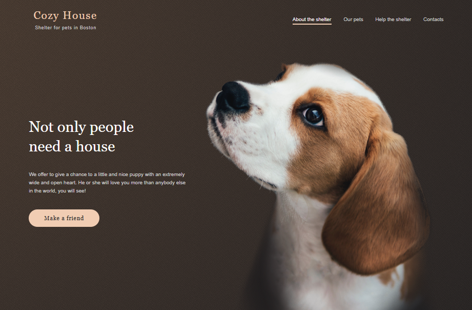
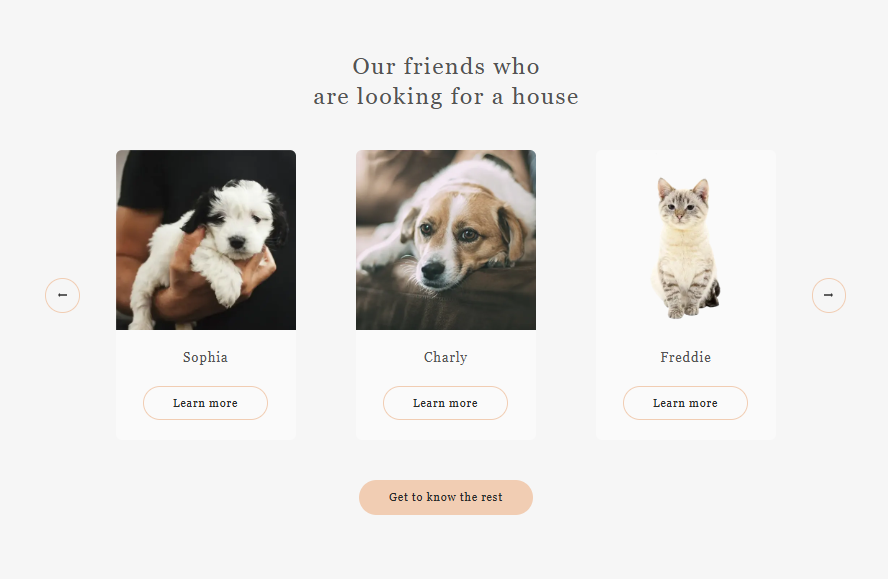

# 🐾 Shelter

---

## 📌 Overview

**Shelter** is a responsive, interactive web application for showcasing pets.  
The project consists of **two main pages** — **Main** and **Pets** — and is built with **HTML, CSS, and pure JavaScript**.  
It provides **adaptive layouts** for screen widths from 320px to 1440px and includes **dynamic functionality** such as a burger menu, infinite slider, pagination, and popups for pet details.

---

## ✨ Features

### Navigation
- 🍔 **Responsive burger menu** on both pages for screens <768px
    - Smooth animation and rotation of the burger icon
    - Full-height overlay with dimmed background
    - Menu closes when clicking outside or on links

### Slider
- 🔄 **Infinite slider carousel** on the Main page
    - Click arrows to move slides with animation
    - Adaptive number of cards per slide depending on screen width (1–3 cards)
    - Pseudorandomized card sets without duplicates on the same slide or consecutive slides
    - New random order generated on page reload
    - Responsive adjustment without page reload

### Pets Page
- 📄 **Pagination for pets cards**
    - First page loads on refresh
    - Navigation with next/prev and first/last page buttons
    - Buttons disabled when at boundaries
    - Randomized pets array with 48 items (8 unique pets × 6)
    - Cards do not repeat on a page
    - Responsive page count (1280px – 6 pages, 768px – 8 pages, 320px – 16 pages)
    - Pagination state preserved without reload

### Popups
- 🖼 **Pet detail popup** on both pages
    - Opens when clicking any pet card
    - Page content behind popup is dimmed and scrolling is disabled
    - Closes when clicking outside or the close button
    - Popup is centered and matches Figma design

---

## 🛠 Technology Stack

- HTML5 & CSS3 (Flexbox, Grid)
- JavaScript (ES6+)
- JSON for pet data
- Responsive design principles (320px–1440px)
- Figma assets exported for design implementation

---

## ▶️ Running the Project

### 📥 1. Clone Repository
`git clone https://github.com/blk-thorn/pet-shelter.git`

### 📦 2. Open in Browser
Open index.html in your browser (no build tools or dependencies required).

---

## 📸 Preview

